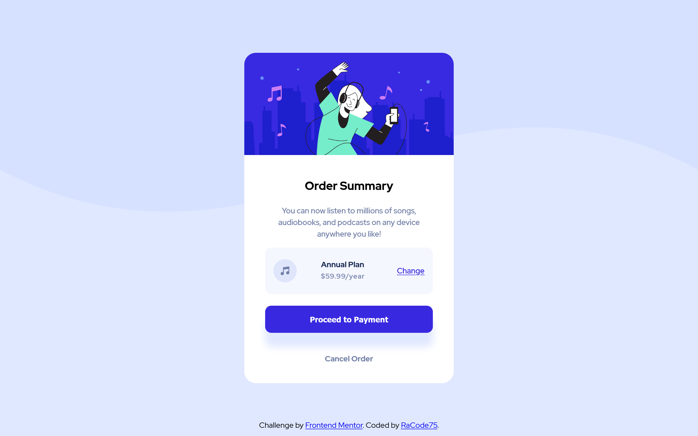
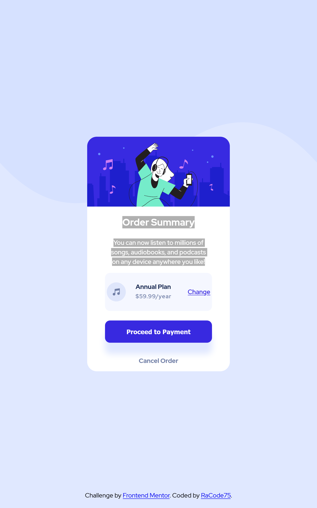

# Frontend Mentor - Order summary card solution

This is a solution to the [Order summary card challenge on Frontend Mentor](https://www.frontendmentor.io/challenges/order-summary-component-QlPmajDUj). Frontend Mentor challenges help you improve your coding skills by building realistic projects. 

## Table of contents

  - [The challenge](#the-challenge)
  - [Screenshot](#screenshot)
  - [Links](#links)
- [My process](#my-process)
  - [Built with](#built-with)
  - [What I learned](#what-i-learned)
  - [Continued development](#continued-development)
  - [Useful resources](#useful-resources)
- [Author](#author)
- [Acknowledgments](#acknowledgments)

### The challenge

Users should be able to:

- See hover states for interactive elements

### Screenshot

### Links

- Live Site URL: (https://racode75.github.io/order-summary-component/)

## My process
HTML structure first,  I fragmented the layout and saw approximately how much tags I need and how to nest them, later reduce them to the minimum necessary.
Position and size for mobile first and later for desktop resolutions.
Then SCSS to actually style the structure.
### Built with

- Semantic HTML5 markup
- CSS custom properties
- Flexbox
- Mobile-first workflow
- SCSS pre-processor

### What I learned

I have a better comprension of Flex Layout an media Querys.

### Continued development

Front and backend.

### Useful resources

- [Example resource 1](https://www.w3schools.com/) - This helped me for XYZ reason. I really liked this pattern and will use it going forward.

## Author

- Website - [RaCode75](http://RaCode75.com.ar)
- Frontend Mentor - [@yourusername](https://www.frontendmentor.io/profile/yourusername)
- Twitter - [@yourusername](https://www.twitter.com/yourusername)

